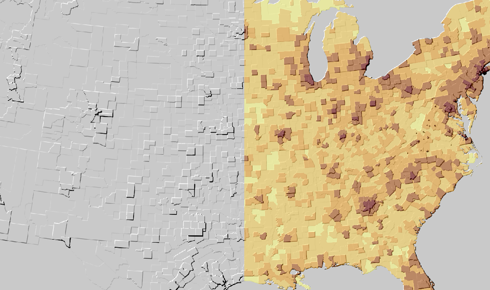
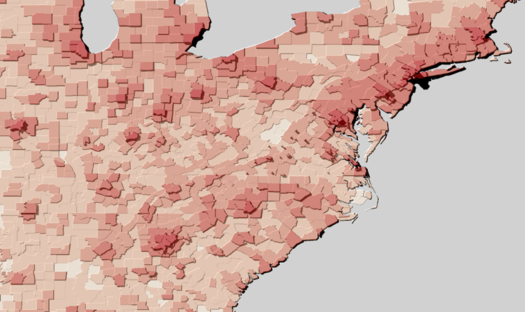
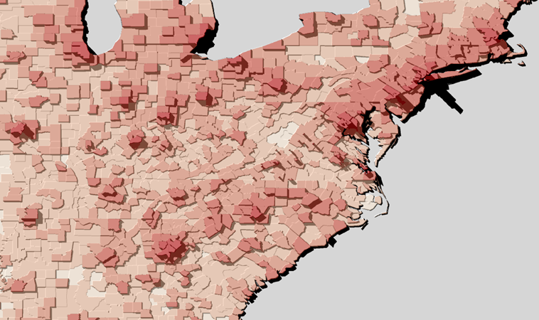

#Choropleth Hillshade
###A Python Geoprocessing Toolbox for ArcGIS

Generates a hillshaded raster surface for choropleth maps.  But why?
* Show off your within-class variability!
* Enable thematic maps to have more than *just* 2 dimensions.
* Experiment with displaying bivariate data.
* Skip the colours altogether, if you can handle it.

For input, this geoprocessing tool only requires a polygon feature class (or shapefile) with attributes appropriate for choropleth mapping, such as densities or percentages.

An illuminated/shaded relief raster based on the attribute of choice (e.g. population density per county) is the output of this tool (*left*), which can be overlayed with the original feature class (*right*).

Raster cell size and overall shadow length are set as tool params.  Compare the different polygon "heights" and the shadows they can cast below:

Inspired by:

* Stewart, James and Kennelly, Patrick J. (2010).
["Illuminated Choropleth Maps"](http://www.tandfonline.com/doi/abs/10.1080/00045608.2010.485449#.UtWdcp5dXzh).
*Annals of the Association of American Geographers*, 100(3): 513-534.

Authors of this tool:
* Jacob Wasilkowski | Esri St. Louis
* Jie Cheng | UMASS Medical School

Note: This PYT requires ArcGIS for Desktop 10.1 SP1 or higher, with access to either the Spatial Analyst or 3D Analyst extension.
